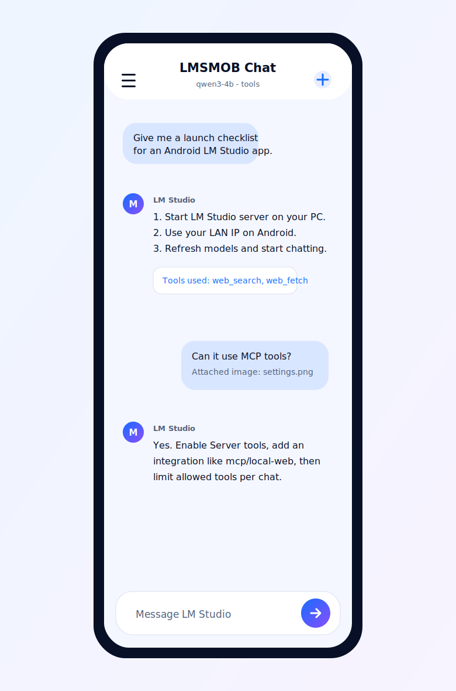
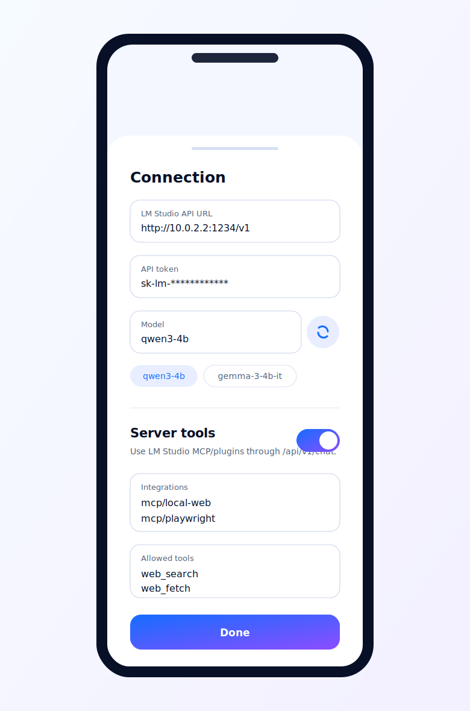

# LMSMOB Chat

[](https://github.com/mindylab/lmsmob_chat/releases/latest)
[](app/build.gradle.kts)
[](app/src/main/java/com/mindylab/lmstudiochat/MainActivity.kt)
[](LICENSE.md)

Android chat app for LM Studio. Connect your phone to an LM Studio server
running on your PC and chat with local LLMs over your LAN.

[Download the latest APK](https://github.com/mindylab/lmsmob_chat/releases/latest)
or open the current
[v1.16 APK asset](https://github.com/mindylab/lmsmob_chat/releases/download/v1.16/lmsmob_chat-v1.16-debug.apk).

## Preview

| Chat | LM Studio settings |
| --- | --- |
|  |  |

## Features

- Native Android app built with Kotlin and Jetpack Compose.
- Works with LM Studio's OpenAI-compatible local server at `/v1`.
- Supports LM Studio's native `/api/v1/chat` endpoint for server tools.
- Connects to LM Studio MCP/plugin integrations such as `mcp/local-web`.
- Refreshes loaded LM Studio models from the app settings.
- Keeps chat sessions locally with search and session switching.
- Supports copy/edit for user messages.
- Imports and exports chat history as JSON.
- Supports image attachments for vision-capable models.
- Includes emulator and physical-device LAN setup paths.

## Quick Setup

1. Install the APK from the
   [latest release](https://github.com/mindylab/lmsmob_chat/releases/latest).
2. Start LM Studio on your PC.
3. Load a model and start the local server from LM Studio.
4. Open LMSMOB Chat settings.
5. Set the LM Studio API URL and model.
6. If LM Studio has authentication enabled, add your LM Studio API token.

The Android emulator default URL is:

```text
http://10.0.2.2:1234/v1
```

For a physical Android device, use your PC's LAN IP address:

```text
http://YOUR_PC_LAN_IP:1234/v1
```

Example:

```text
http://192.168.1.25:1234/v1
```

## Server Tools And MCP

LM Studio 0.4.0+ can call MCP/plugin tools through its native
`/api/v1/chat` endpoint. In LMSMOB Chat, open settings, enable
**Server tools**, and add the LM Studio integration IDs you want to allow.

Server-side tools require an LM Studio API token. In LM Studio, create a
permission token from **Developer > Server Settings > Manage Tokens**, then
paste it into the app's **API token** field. The token must allow the MCP/tool
permissions you want to use.

When **Server tools** is enabled, tap the refresh icon beside the model field.
The app loads model IDs from `/api/v1/models` and prefers currently loaded LLM
instances, which is what `/api/v1/chat` expects.

For an MCP server already configured in LM Studio's `mcp.json`, add one plugin
ID per line:

```text
mcp/local-web
mcp/gemma4-audio-python
```

Bare server labels are normalized by the app. For example, `local-web` becomes
`mcp/local-web`.

For broad local tools, fill **Allowed tools** in the app settings with one tool
name per line. The app will send:

```json
{
  "type": "plugin",
  "id": "mcp/local-web",
  "allowed_tools": ["web_fetch"]
}
```

Against the tested server, `mcp/local-web` accepted these allowed tools:

```text
web_search
web_fetch
web_search_and_fetch
```

For an ephemeral remote MCP, paste a JSON object or JSON array:

```json
{
  "type": "ephemeral_mcp",
  "server_label": "huggingface",
  "server_url": "https://huggingface.co/mcp",
  "allowed_tools": ["model_search"]
}
```

When server tools are enabled, the app sends chat requests to:

```text
http://HOST:1234/api/v1/chat
```

LM Studio server settings must allow the relevant MCP/plugin type.

## Build

With Android Studio's JDK and SDK available:

```powershell
.\gradlew.bat assembleDebug
```

The debug APK is generated under:

```text
app/build/outputs/apk/debug/
```

To build a release APK:

```powershell
.\gradlew.bat assembleRelease
```

The project can sign release builds when a local `keystore.properties` file is
present. See [docs/release-signing.md](docs/release-signing.md). Do not commit
keystores, passwords, or `keystore.properties`.

## Keywords

LM Studio Android app, LM Studio mobile client, Android local LLM chat, local AI
Android app, OpenAI-compatible Android client, MCP Android chat, Kotlin Jetpack
Compose AI chat, local server chat app.

## License

LMSMOB Chat is proprietary software owned by MindyLab MB. Use,
redistribution, modification, commercialization, or rebranding requires prior
written permission. See [LICENSE.md](LICENSE.md).
